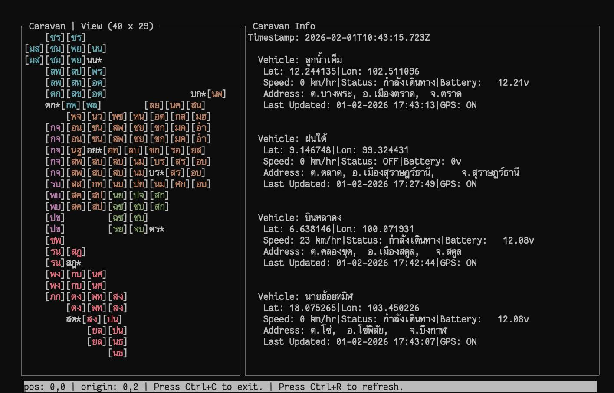
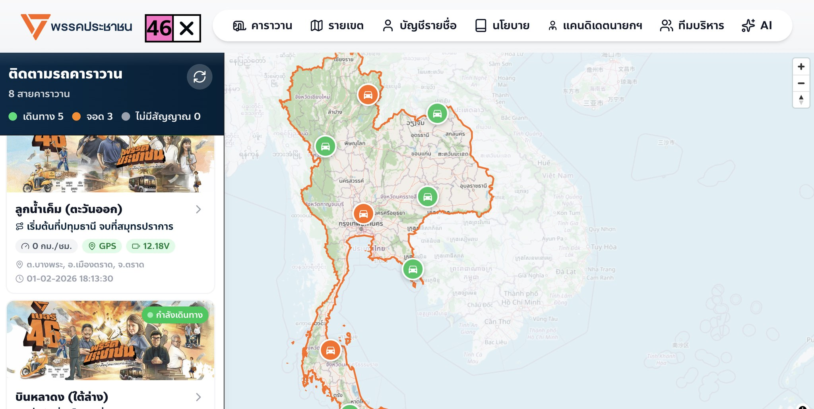

People's Party Caravan — Minimal Terminal Tracker

Hello,

This is a small, minimal terminal UI (TUI) for quick, fun real-time checks of the People's Party (พรรคประชาชน) caravan vehicles for 2026 election. The official web tracker streams all caravan lines live at:

https://election69.peoplesparty.or.th/

Screenshots

<p>
	
	
</p>

Purpose
- Provide a quick terminal-based view to monitor caravan vehicles without opening a browser.

Dependencies
- Go 1.25.0
- github.com/jroimartin/gocui

Key details
- Default refresh interval: 5 seconds
- View: province-level (ระดับจังหวัด)
- Navigation: `h`, `j`, `k`, `l` for cursor movement
- Uses only the standard 8-color SGR palette
- Some values are hard-coded for simplicity

Known issues & notes
- Refresh and scrolling still have bugs — use with caution.
- The implementation is minimal and can be further optimized.

Build & Run
1. Ensure Go 1.25.0 is installed.
2. Fetch dependencies and build:

```bash
go mod tidy
go run main.go
```

Or build a binary:

```bash
go build -o caravan-tracker ./
./caravan-tracker
```

<!-- Images above show the web tracker and TUI screenshot at reduced size -->

Where to look next
- Change refresh interval or view level in source if you want different behavior.

License
- No license specified. Use at your own risk.
